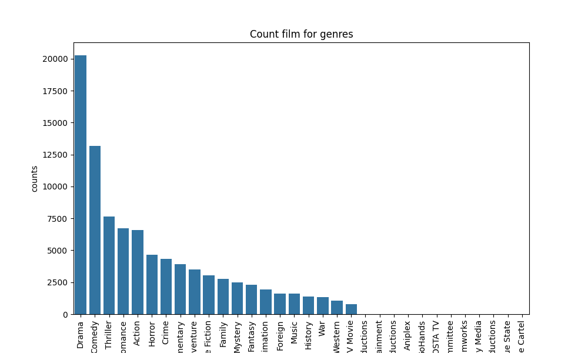

# Movie Genre Analysis Script

## Overview
This script loads a movie metadata dataset and performs data cleaning and genre analysis using **pandas**, **matplotlib**, **seaborn**, and **ast**.
It extracts genres from the dataset, counts their frequency, and visualizes the distribution using a bar chart.

## Features
- Loads dataset from `./data/movies_metadata.csv`
- Cleans missing values in:
  - `tagline` → "without tagline"
  - `homepage` → "No homepage"
  - `belongs_to_collection` → "{}"
- Extracts genre names using `ast.literal_eval`
- Counts occurrences of each genre across all movies
- Generates a bar plot visualizing genre frequency

## Visualization
The script generates a bar chart showing genre counts:



The figure file is located at:
```
figure/Figure_1.png
```

## Requirements
- Python 3.x
- Libraries:
  - pandas
  - numpy
  - matplotlib
  - seaborn

Install missing libraries:
```bash
pip install pandas numpy matplotlib seaborn
```

## Usage
Run the script:
```bash
python script_name.py
```

Ensure the dataset is available at:
```
./data/movies_metadata.csv
```
